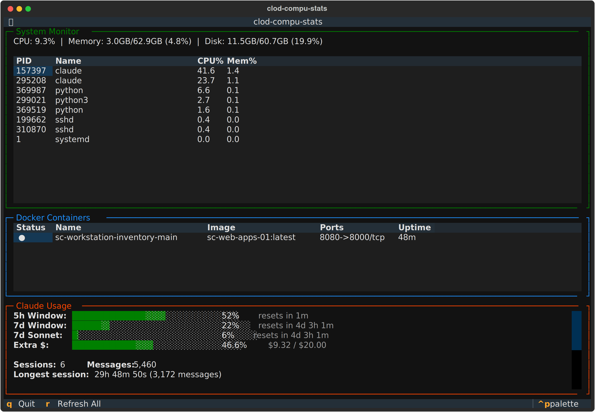

# clod-compu-stats

Terminal dashboard that shows system metrics, Docker container status, network info, git repos, health checks, and Claude usage stats in a single view. Built with Python + [Textual](https://github.com/Textualize/textual).



## Panels

| # | Panel | Description |
|---|-------|-------------|
| 1 | **System Monitor** | CPU, memory, disk, load averages, uptime, SSH sessions, top processes |
| 2 | **Network** | Interfaces, IPs, rx/tx rates, connections, gateway, DNS |
| 3 | **Git Repositories** | Scans `~/apps/` for repos — branch, uncommitted changes, last commit |
| 4 | **Docker Containers** | Status, name, image, ports, uptime |
| 5 | **Health Checks** | Hits health endpoints on Docker containers with exposed ports |
| 6 | **Claude Usage** | Live utilization bars (5h/7d) from Anthropic API + token breakdowns from `~/.claude/stats-cache.json` |

All panels are collapsible (press `1`-`6`) and reorderable (`Ctrl+Up/Down`).

## Setup

```bash
# Requires python3.12-venv: sudo apt install python3.12-venv
./setup.sh
```

## Usage

```bash
./run.sh
```

### Keybindings

| Key | Action |
|-----|--------|
| `1`-`6` | Toggle panel collapsed/expanded |
| `Ctrl+Up` | Move focused panel up |
| `Ctrl+Down` | Move focused panel down |
| `Tab` | Cycle focus between panels |
| `r` | Refresh all expanded panels |
| `q` | Quit |

## Requirements

- Python 3.12+
- Docker (optional — panel shows graceful fallback)
- Claude Code credentials at `~/.claude/.credentials.json` for live usage data
